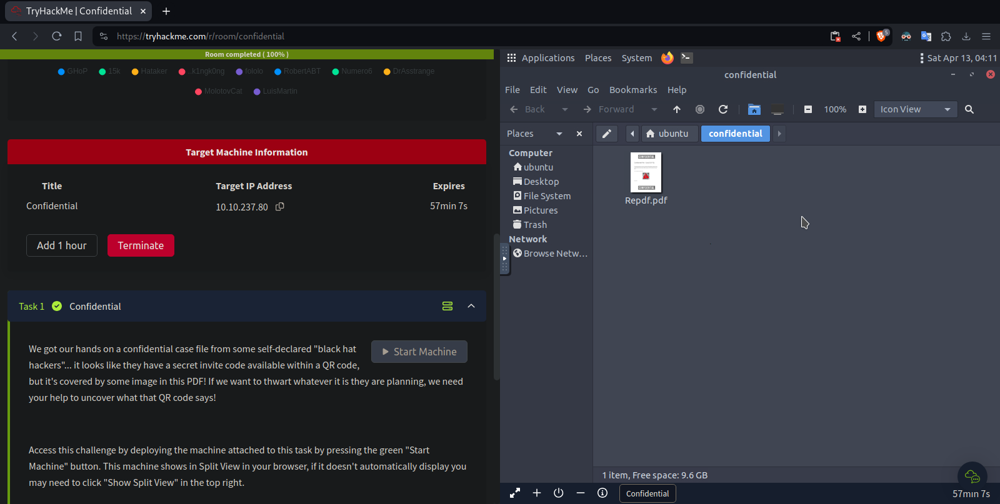
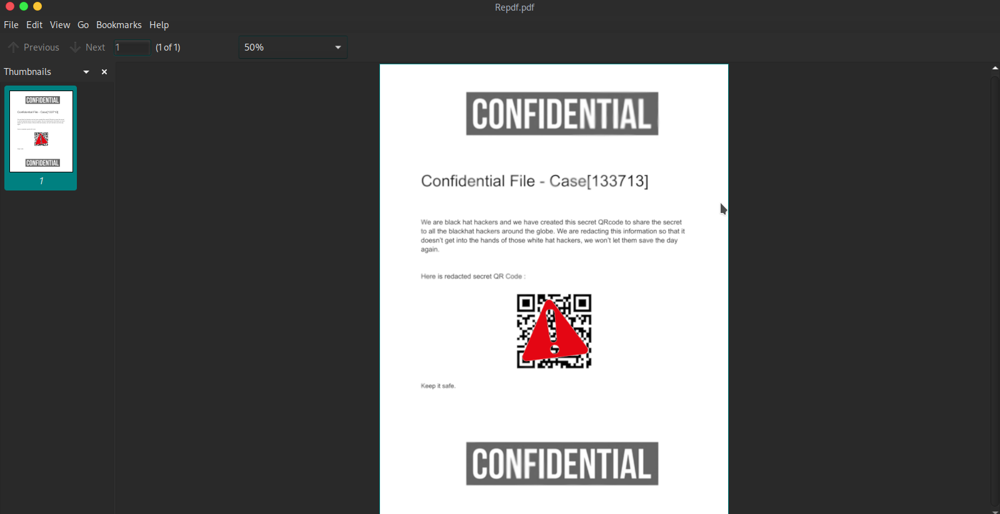

# [Confidential](https://tryhackme.com/r/room/confidential)

We start the machine and open an AttackBox machine.



We will transfer the pdf to our local machine using **python**.

In the *AttackBox machine*:

```shell
ubuntu@thm-confidential:~$ cd /home/ubuntu/confidential/
ubuntu@thm-confidential:~/confidential$ python3 -m http.server 8080
Serving HTTP on 0.0.0.0 port 8080 (http://0.0.0.0:8080/) ...
10.8.100.192 - - [13/Apr/2024 04:19:45] "GET /Repdf.pdf HTTP/1.1" 200 -
```

In our *local machine*:

```shell
$ wget http://10.10.237.80:8080/Repdf.pdf
--2024-04-12 23:19:46--  http://10.10.237.80:8080/Repdf.pdf
Connecting to 10.10.237.80:8080... connected.
HTTP request sent, awaiting response... 200 OK
Length: 102818 (100K) [application/pdf]
Saving to: ‘Repdf.pdf.1’

Repdf.pdf.1                100%[======================================>] 100.41K   176KB/s    in 0.6s    

2024-04-12 23:19:47 (176 KB/s) - ‘Repdf.pdf.1’ saved [102818/102818]
```

The PDF has a covered QR code, we need some way to separate that warning notice.



Using **binwalk** we found some things, but nothing interesting.

```shell
$ binwalk Repdf.pdf

DECIMAL       HEXADECIMAL     DESCRIPTION
--------------------------------------------------------------------------------
0             0x0             PDF document, version: "1.5"
74            0x4A            Zlib compressed data, default compression
711           0x2C7           Zlib compressed data, default compression
1154          0x482           Zlib compressed data, default compression
1593          0x639           Zlib compressed data, default compression
89587         0x15DF3         Zlib compressed data, default compression
92993         0x16B41         Zlib compressed data, default compression
```

> If you want to extract the files, use: `binwalk -e Repdf.pdf -C output`

Now we use **pdfimages** to extract all images.

```shell
$ pdfimages -all Repdf.pdf image
$ ls -al
total 300
drwxr-xr-x 1 martin martin    148 Apr 12 23:35 .
drwxr-xr-x 1 martin martin     80 Apr 12 23:03 ..
-rw-r--r-- 1 martin martin  73224 Apr 12 23:35 image-000.png
-rw-r--r-- 1 martin martin   8743 Apr 12 23:35 image-001.png
-rw-r--r-- 1 martin martin   3320 Apr 12 23:35 image-002.png
...
```

Open the firts image with `open image-000.png` and we can see the QR.


By scanning the QR we can see the flag.
