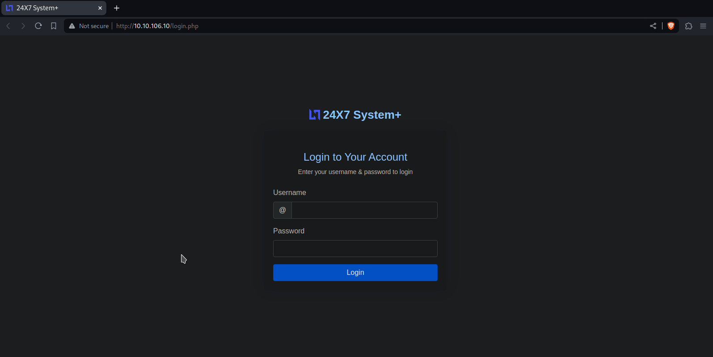
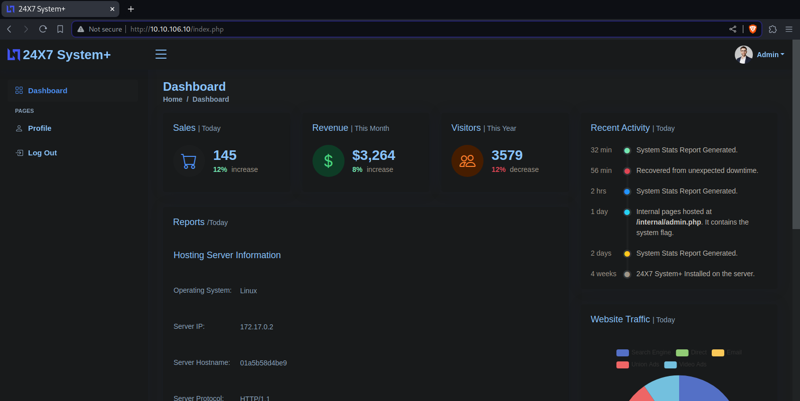
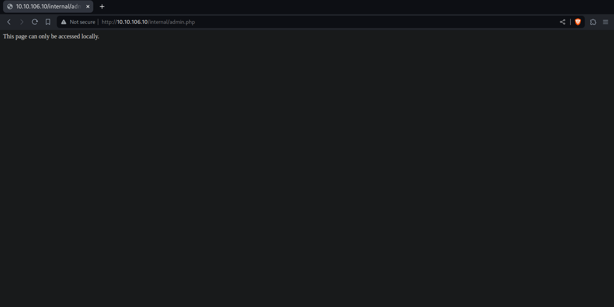
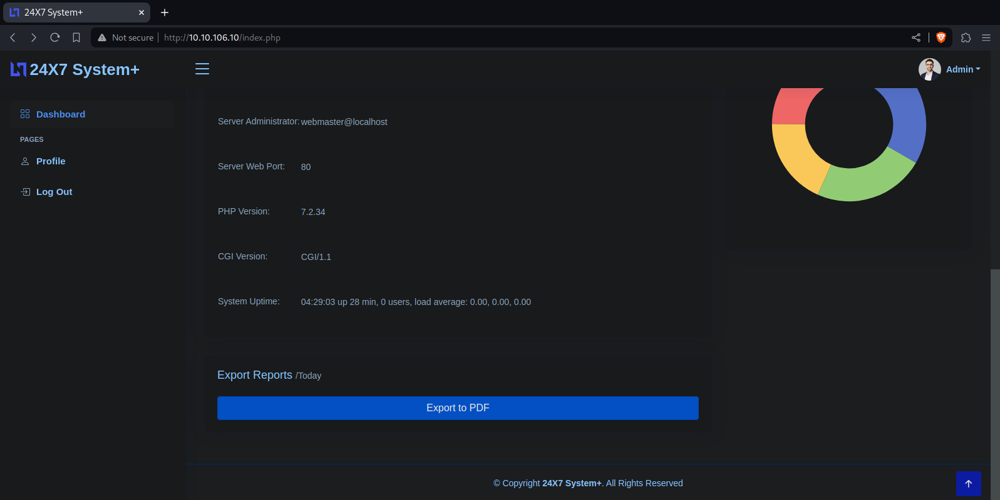
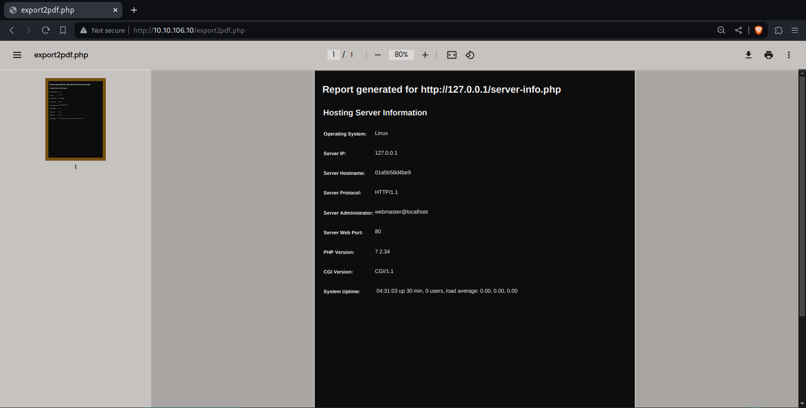
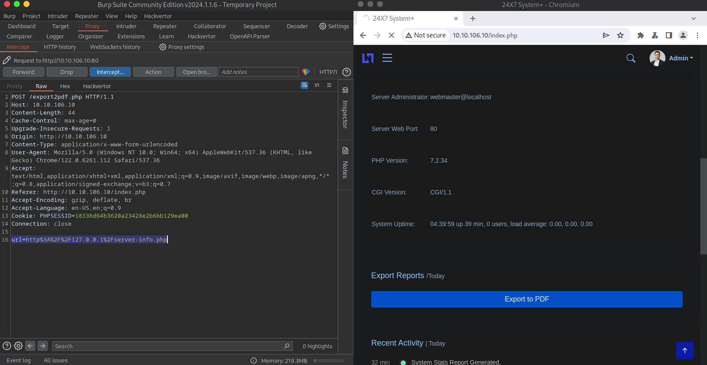
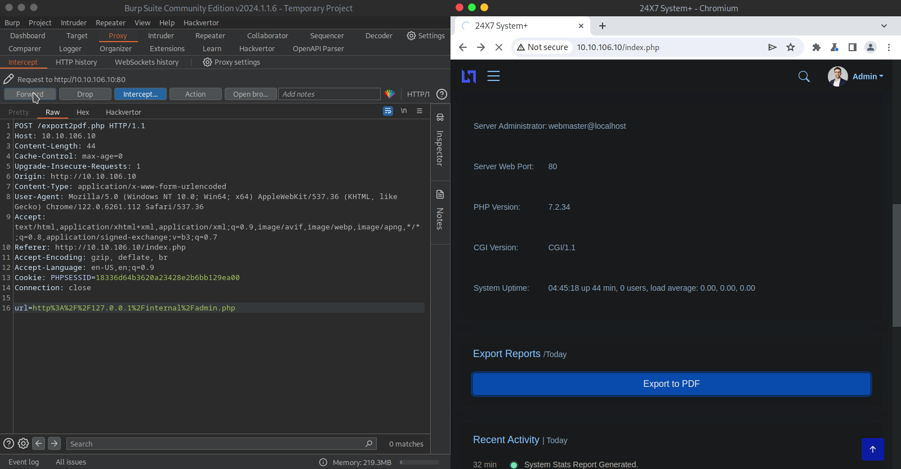

# [Surfer](https://tryhackme.com/r/room/surfer)

> We will declare the ip machine in IP, use: `$ export IP=10.10.106.10`

## Enumeration

Firstly, we are goint to enumarate the open port with nmap.

```shell
$ sudo nmap -p- -n -Pn -sS --min-rate 2000 $IP -oN open-ports.txt
Starting Nmap 7.94SVN ( https://nmap.org ) at 2024-04-09 23:05 -05
Nmap scan report for 10.10.106.10
Host is up (0.21s latency).
Not shown: 65533 closed tcp ports (reset)
PORT   STATE SERVICE
22/tcp open  ssh
80/tcp open  http

Nmap done: 1 IP address (1 host up) scanned in 43.30 seconds
```

We have a web server on port 80. the website shows us a login panel.



We tried with common users and managed to log int with `admin:admin`, then we were redirected to a dashboard.



We find the flag in the recent activities, it tells us the url of the flag but wheeb we ebter it tells us that it can only be seen locally.



On the same dashboard page we find the functionality to export a report to pdf.



In the exported pdf we see how a local call is made to http://127.0.0.1/server-info.php.



We intercept the request with BurpSuit and see that we can edit the url where the request is made.



Change the url and we can see the flag.


